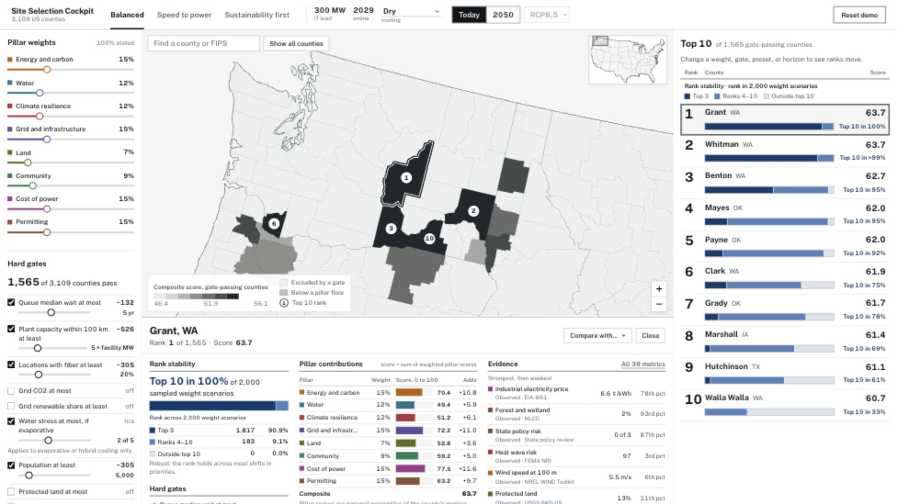

# Site Selection Cockpit

An interactive, explainable decision tool for screening U.S. counties for a large AI data center. The cockpit combines hard feasibility gates, eight weighted decision pillars, future climate scenarios, and rank-stability analysis to turn 39 populated metrics into an auditable shortlist.



The committed demo models a **300 MW campus targeting 2029**. Under the balanced preset, 1,565 of 3,109 contiguous U.S. counties pass the hard gates; Grant County, Washington leads the current shortlist, narrowly followed by Whitman and Benton counties.

## What the cockpit does

- Screens all 3,109 counties in the contiguous United States.
- Applies explicit hard gates for hazards, grid capacity, queue timing, fiber, population, moratoria, water stress, and sensitive land.
- Scores eight pillars: energy and carbon, water, climate resilience, grid and infrastructure, land, community, permitting, and cost of power.
- Recalculates the national ranking immediately when a user changes a weight, gate, facility assumption, preset, or horizon.
- Compares today's conditions with mid-century heat and water projections.
- Runs 2,000 Dirichlet weight scenarios and shows how often each county remains in the top 3, ranks 4–10, or outside the top 10.
- Explains each result with pillar contributions, strongest and weakest evidence, gate outcomes, and county-to-county comparison.
- Keeps the current configuration in the URL so a finding can be reopened or shared.

## Decision method

The shipped ranking is deterministic and transparent; it does not use machine learning.

1. **Gate:** Remove counties that violate non-negotiable facility conditions.
2. **Normalize:** Convert each metric to a national percentile, respecting whether higher or lower values are better.
3. **Aggregate:** Average available metrics into eight pillar scores.
4. **Rank:** Calculate a weighted composite using the selected preset or user-adjusted weights.
5. **Protect against hidden weaknesses:** Place counties below the preset's pillar floor behind counties that clear it.
6. **Test stability:** Draw 2,000 weight vectors from a Dirichlet distribution centered on the stated weights and rerank the eligible counties.

The weights are declared business preferences rather than fitted coefficients. The repository also evaluates equal weights, uniformly random weights, monetized 25-year cost, CRITIC, entropy, revealed preference, and a cross-method consensus. See [Pillar weighting: methods and results](docs/weighting.md).

### Presets

| Preset | Intended decision | Key emphasis |
| --- | --- | --- |
| Balanced | Default 2029 siting screen | Long-term feasibility and economic viability |
| Speed to power | Developer targeting 2028 | Grid readiness, permitting, and power cost |
| Sustainability first | Hyperscaler with 24/7 clean-energy and water goals | Energy and carbon, water, stricter gates, and the 2050 horizon |

The 2050 view is a scenario stress test, not a complete forecast. It replaces present-day cooling-degree days, extreme-heat days, and water stress with CMRA and WRI Aqueduct mid-century projections. Other inputs remain at their current values.

## Architecture

```text
Public data sources
        |
        v
Python geospatial ETL  -->  county_features.parquet + manifest
        |                              |
        v                              v
Python reference engine       browser data export
        |                              |
        v                              v
results/*.csv              React + TypeScript cockpit
                                      |
                                      v
                         in-browser ranking and explanation
```

The production cockpit is a static React application. It does not require a running API server: the Python pipeline prepares the county data, and a parity-tested TypeScript implementation reruns the ranking in the browser.

## Technology

| Layer | Tools |
| --- | --- |
| Frontend | React, TypeScript, Vite, D3 Geo, TopoJSON, custom CSS |
| Decision engine | Python, NumPy, pandas, PyYAML; TypeScript browser port |
| Geospatial ETL | GeoPandas, Shapely, Rasterio, rasterstats, PyArrow |
| Analytical prototype | Streamlit, Plotly |
| Testing | pytest, Vitest, Playwright, Python/TypeScript parity tests |
| Data formats | Parquet, CSV, JSON, GeoJSON, TopoJSON, YAML |

## Run the React cockpit

Requirements: Node.js and npm.

```bash
cd app/cockpit
npm ci
npm run dev
```

Open [http://127.0.0.1:5173/?preset=balanced](http://127.0.0.1:5173/?preset=balanced). The committed `engine-export.json` and county geometry are enough to run the final hackathon build.

Build and test the frontend:

```bash
cd app/cockpit
npm run typecheck
npm test
npm run build
npm run e2e
```

## Run the Python engine

Requirements: Python 3 and a virtual environment.

```bash
python3 -m venv .venv
source .venv/bin/activate
pip install -r requirements.txt

python -m engine rank \
  --conditions engine/conditions/balanced.yaml \
  --features data/processed/county_features.parquet \
  --out results/balanced.csv

pytest -q
```

The original Streamlit analytical interface remains available:

```bash
streamlit run app/app.py
```

## Rebuild the data export

The repository includes the frozen data and results used for the demo. To rebuild from source data:

```bash
source .venv/bin/activate
export BLS_CONTACT_EMAIL=you@example.com
python -m etl.build_features

cd app/cockpit
npm run data
```

`etl.build_features` caches downloads under `data/raw/`, writes the processed county table and quality report, and records provenance in `data/processed/county_features.manifest.json`. A new source download should be semantically reproducible, but it may not be byte-identical to the frozen hackathon artifact.

Whenever the Python engine, its presets, or the feature table changes, regenerate the browser export and run the parity suite before publishing the cockpit.

## Data foundations

The county table combines about 20 documented public sources, including:

- EPA eGRID and Green Book
- EIA electricity prices and generating-plant capacity
- LBNL Queued Up interconnection data
- FEMA National Risk Index
- WRI Aqueduct 4.0
- Climate Mapping for Resilience and Adaptation (CMRA)
- FCC Broadband Data Collection
- Census, BLS, and BEA demographic and workforce data
- USGS PAD-US and NLCD land-cover data
- NREL wind-resource data
- U.S. Drought Monitor
- FracTracker Alliance data-center and moratorium records

Source URLs, formats, joins, coverage, and known caveats are recorded in [research/data_inventory.md](research/data_inventory.md) and [docs/schema.md](docs/schema.md).

## Repository map

```text
app/cockpit/       React production cockpit and browser-side engine
app/app.py         Original Streamlit analytical interface
engine/            Python ranking engine, pillar definitions, and presets
etl/               Source adapters, geospatial joins, and quality checks
data/processed/    Frozen county table, manifest, and lookup tables
results/           Reproducible preset rankings
research/          Source verification, assumptions, and risk research
docs/              Methodology, demo script, figures, and decision logs
tests/             Python engine, ETL, application, and regression tests
```

## Important limitations

- This is a national county screen, not a parcel recommendation or an interconnection study.
- State electricity prices and grid-subregion emissions are broad proxies; a new 300 MW load would negotiate a project-specific tariff and supply agreement.
- County averages can hide parcel-level land, cultural-resource, transmission, water, and permitting constraints.
- Default weights and several thresholds are stated value judgments. The controls and stability analysis expose their effect rather than presenting them as objective truth.
- The 2050 switch projects selected climate and water variables only; it does not project future prices, population, permitting policy, fiber, or generation infrastructure.
- Missing values never exclude a county by themselves. The engine reports coverage and renormalizes over available information.

The project explicitly tested a permitting-opposition classifier and rejected it after validation showed that its apparent performance came from label construction. The final ranking uses sourced, inspectable columns instead. See [research/permitting_model.md](research/permitting_model.md).

## Further reading

- [Conditions, presets, gates, and robustness](docs/conditions.md)
- [Data contract and provenance](docs/schema.md)
- [Weighting methods and sensitivity analysis](docs/weighting.md)
- [Sustainability-impact assumptions](research/impact.md)
- [Grant County implementation plan](research/implementation.md)
- [Sensitive-land review](research/sensitive_land.md)
- [Demo walkthrough](docs/demo_script.md)

FracTracker Alliance data is used with attribution and is available for non-commercial use. Review each upstream source's terms before commercial reuse.
